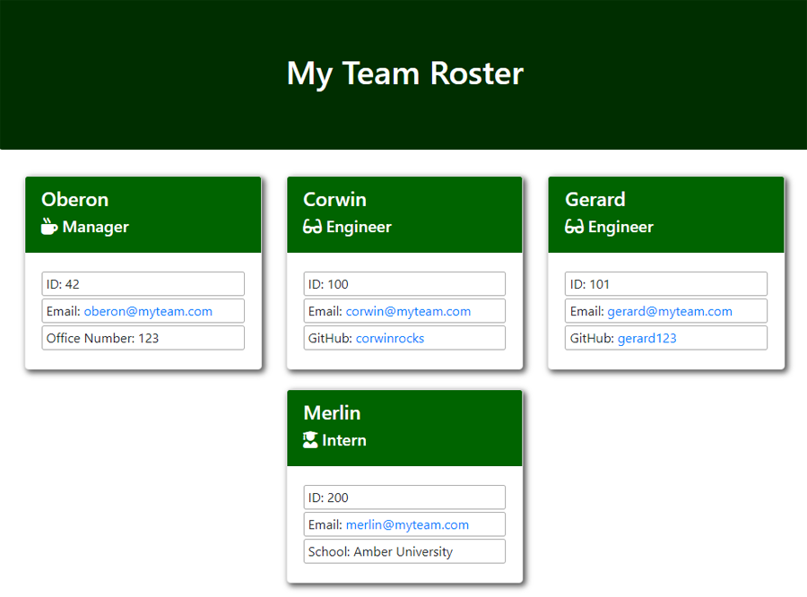

# team-profile-generator
[](https://opensource.org/licenses/ISC)
## Description
A node.js command-line application to generate an HTML file containing details of team members. It prompts for details regarding the team's manager, engineers, and interns and renders an HTML and CSS file with the provided information.

Makes uses of node.js, the Inquirer package, and the Jest package for class testing.

## Table of Contents
* [Installation](#Installation)
* [Usage](#Usage)
* [Example](#Example)
* [Testing](#Testing)
* [License](#License)
* [Questions](#Questions)

## Installation
To install, run the following command:  
```
npm install
```

## Usage
Requires node.js to run. Execute with 'node index.js'. When complete, the HTML and CSS files will be saved to the ./dist directory.

[Walkthrough Video](#)

## Example
  
[Example Output](https://github.com/malenchite/team-profile-generator/blob/main/example)

## Testing
To test, run the following command:  
```
npm test
```

## License  
This application is covered under the **ISC** license. More info can be found here: [ISC](https://opensource.org/licenses/ISC)

## Questions
Questions about the project? You can contact me at malenchite@gmail.com or check out my GitHub profile at [malenchite](https://github.com/malenchite)

## Credits
[Inquirer](https://www.npmjs.com/package/inquirer) node.js package  
[Jest](https://www.npmjs.com/package/jest) node.js package
